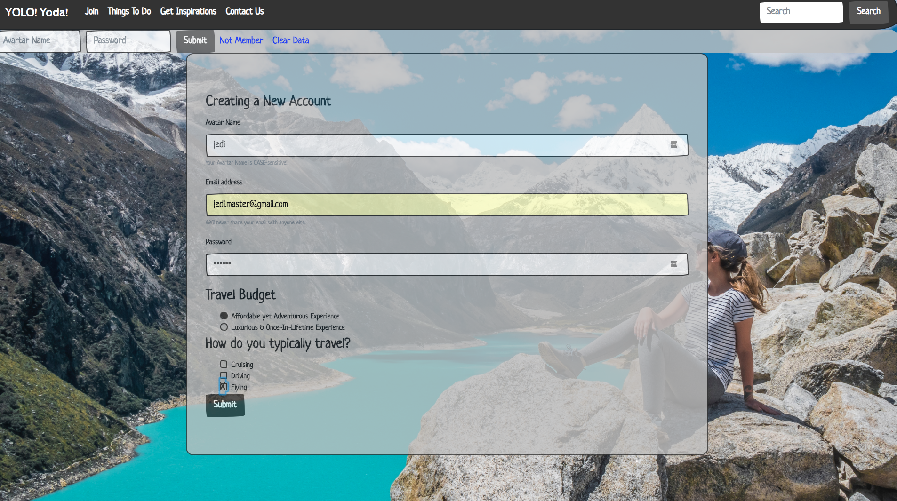
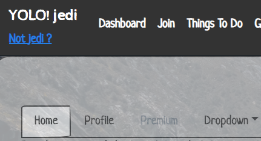
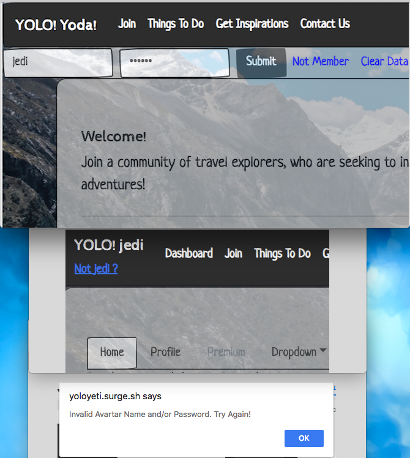
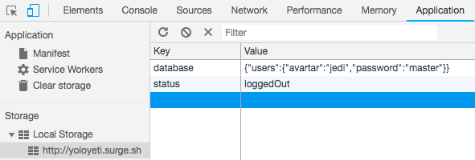

# Yolo! Yeti

### Description
>Imagine the time spent researching and planning for your next memorable trip during valuable yet short vacation.

**Yolo! Yoda** is striving to deliver the seamless experience to individuals, who are looking for inspiring yet tailored travel plans curated by experienced wanderlust travel bloggers in the industry.

Visit Us: http://yoloyeti.surge.sh

### Users
* Travelers looking for travel inspirations and recommendations
* Travel Bloggers looking to share travel experience and inspirations
* Travel Agency looking to expand brand awareness with special package rates

### Browser Rendering Requirements
* Internet Explorer 9 & 10
* Firefox 7 and higher
* Chrome 14 and higher
* Safari 5 and higher
* Opera 11 and higher
* Mobile Safari 3.2 and higher
* Opera Mobile 5 and higher
* Android 2.1 and higher

## Technolody Usage

* HTML *(Hypertext Markup Language)*
* CSS *(Cascading Style Sheets)*
* JavaScript

## Agile Project Tracking
>Trello:
https://trello.com/b/GInKh2NL/sein-tun-galvanize-g101-wdi-quarter-project

## Contributing
Pull requests are welcome. For major changes, please open an issue first to discuss what you would like to change.

`$ git clone https://github.com/(github-user)/travelerSocialMedia.git`

Please make sure to update tests as appropriate.

## License
[Yolo!Yeti](http://travelExplorer.surge.sh)

### Screenshots
1. Landing Page (Desktop)

.png)

2. Landing Page (iPad Landscape)

.png)

3. Landing Page (iPhone 5)

.png)

3. Landing Page (iPhone X)

.png)

4. Mobile Dropdown Menu

.png)

5. Join Registration Page

6. User Dashboard

7. Login Process

8. Local Storage Preview

